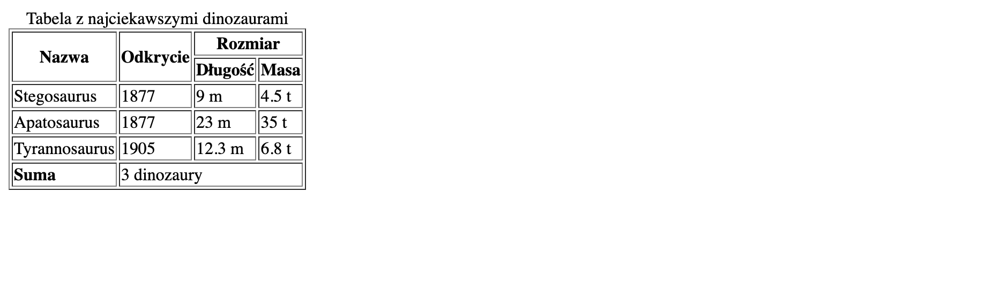

# Zadanie - CSS 01

1. Usuń atrybut `borded` z taga `<table>`

2. Stosująć inlinowy CSS dodaj style, tak aby tabela wyglądała tak jak przed zmianami

3. Usuń tag `<b>` i dodaj odpowiednie style CSS, aby słowo `Suma` było pogrubione

4. Efekt końcowy powinien wyglądać w ten sposób:
    

5. Pamiętaj, aby Twoja strona była poprawna [https://validator.w3.org/](https://validator.w3.org/)