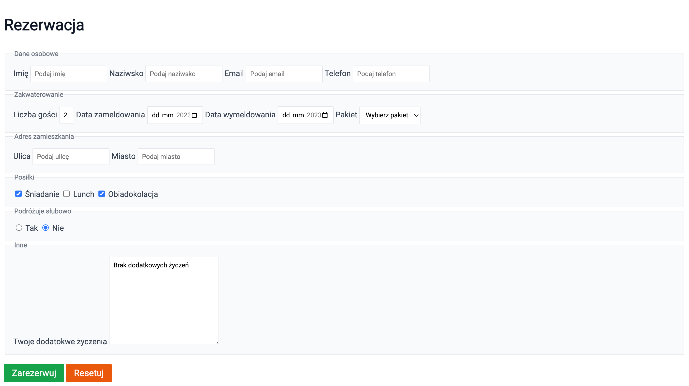

# Zadanie - HTML 06

1. Do głowy strony dodaj tag `<style>`

2. W tagu umieść style korzystając z ponizszych informacji:
    - Wszystkie elementy: 'Roboto' z fallbackiem do sans-serif
    - Tytuł: pogrubiony o rozmiarze 2rem w kolorze `#111827`
    - Grupa pól: ramka o grubości 1px w kolorze `#e5e7eb` z marginesem wewnętrznym 0.5rem i kolorem tła `#f9fafb`
    - Tytuł grupy pól: pogrubiony w kolorze `#6b7280` o rozmiarze 0.85rem
    - Pola w formularzu: ramka o grubości 1px kolorze `#e5e7eb` o zaokrągleniu 0.125rem z marginesem wewnętrznym 0.5rem
    - Etykiety pól: w kolorze `#374151`
    - Przyciski: z białtm tekstem o rozmiarze 1.15rem, bez ramki, zaokrąglone o 0.125rem, z marginesem wewnętrznym 0.5rem ( góra-dół ) i 1rem ( lewo-prawo ). Przycisk "Zarezerwuj" powinien mieć tło `#16a34a`, a przycisk "Resetuj" `#ea580c`

3. Efekt końcowy powinien wyglądać w ten sposób:
    
