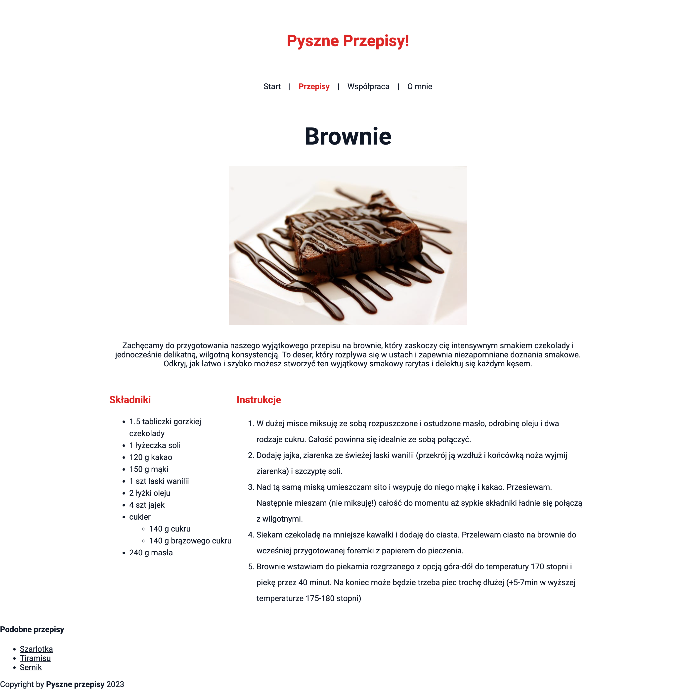

# Zadanie - HTML 03

1. Stwórz plik `styles.css` i podłącz do strony internetowej

2. W pliku dodaj odpowiednie style, aby osiągnąć efekt końcowy. Postaraj się korzystać głównie z klas
    - Wszystkie elementy: czcionka 'Roboto' z fallbackiem do sans-serif w kolorze `#111827`
    - Klasa `app-header`: margines wewnętrzny 4rem ( góra-dół ) i 1rem ( lewo-prawo )
    - Klasa `app-title`: wyśrodkowany tekst o rozmiarze 2rem w kolorze `#dc2626`, bez marginesów
    - Klasa `app-navigation`: wyśrodkowanie i margines dolny 4rem
    - Linki będące dziećmi elementu z klasą `app-navigation`: margines 0 ( góra-dół ) 0.75rem ( lewo-prawo ), bez podkreślenia
    - Klasa `active-link`: pogrubiwenie 600, w kolorze `#dc2626`
    - Klasa `recipe-container`: maksymalna szerokość 60rem i wyśrodkowany
    - Klasa `recipe-title`: tekt o rozmiarze 3rem, wyśrodkowany, z tylko marginesem dolnym 2rem
    - Klasa `recipe-image`: wyświetlany blokowo, maksymalna szerokość 30rem, margines 2rem ( góra-dół ) auto ( lewo-prawo )
    - Klasa `recipe-description`: wyśrodkowany tekst z marginesem dolnym 2rem
    - Klasa `recipe-content`: wyświetlana jako flex
    - Klasa `recipe-ingredients-section`: szerokość 100%, ale maksymalna szerokość 16rem
    - Klasa `recipe-subtitle`: tekst o rozmiarze 1.25rem w kolorze `#dc2626`
    - Klasa `recipe-ingredients-list`: interlinia 1.5
    - Klasa `recipe-instructions-list`: interlinia 2

3. Efekt końcowy powinien wyglądać tak:
    

