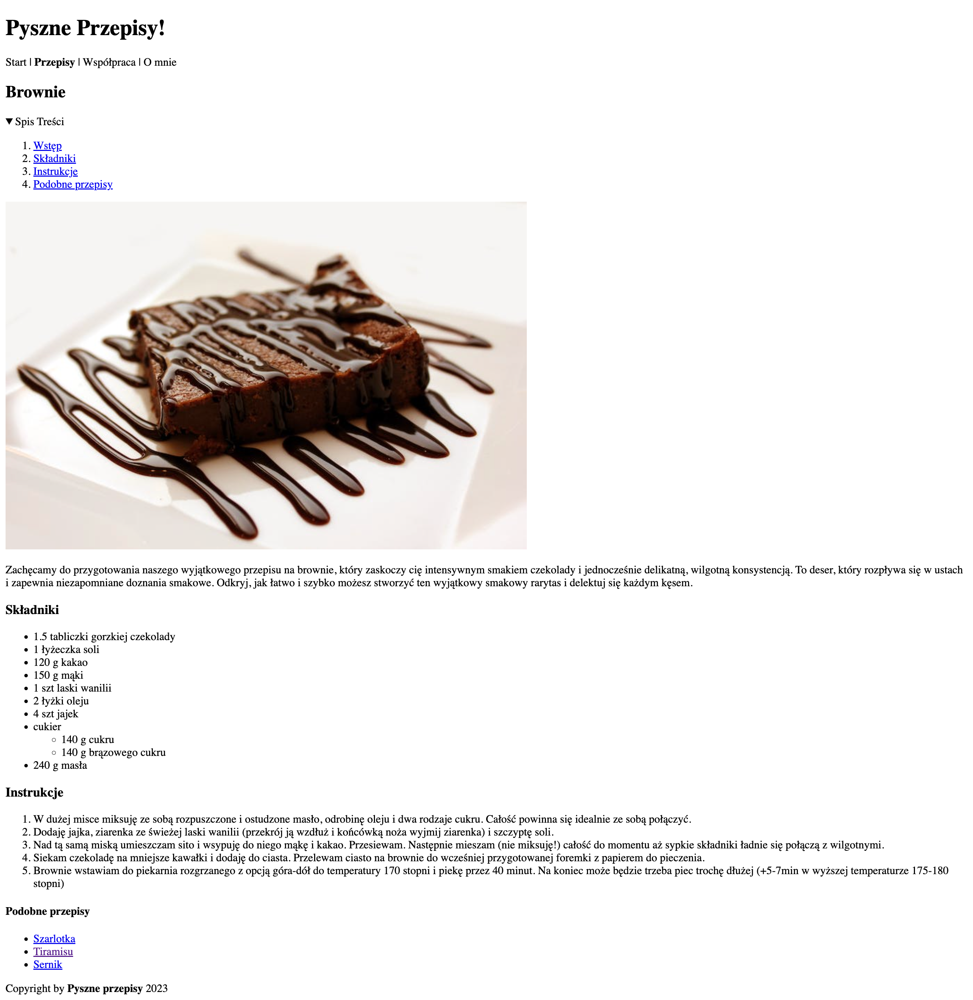

# Zadanie - HTML 03

1. Do strony dodaj spis treści. Kliknięcie w element spisu treści powinien przenieść do odpowiedniej sekcji

2. Efekt końcowy powinien wyglądać tak:
    

3. Pamiętaj, aby Twoja strona była poprawna [https://validator.w3.org/](https://validator.w3.org/)