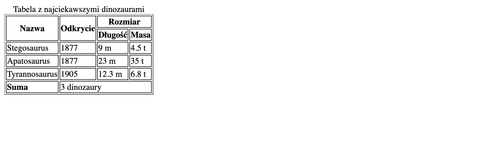

# Zadanie - HTML 04

1. Dodaj kod HTML, który stworzy tabelę. Efekt końcowy powinien wyglądać tak:
    

3. Pamiętaj, aby Twoja strona była poprawna [https://validator.w3.org/](https://validator.w3.org/)
    Pomiń błąd o atrybucie `border`