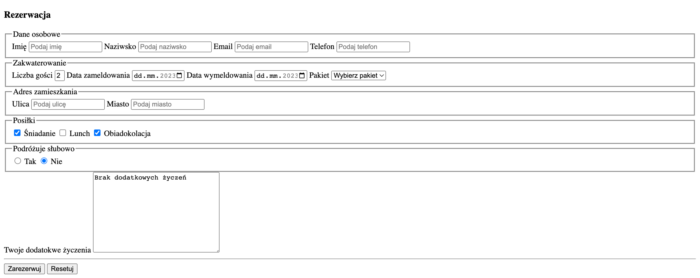

# Zadanie - HTML 06

1. Uzupełnij wszystkie pola o placeholdery

2. Dodaj domyślne wartości i walidację zgodnie z komentarzami w pliku `index.html`

3. Wynieś przyciski poza formualrz i oddziel je `
`. Przyciski wcią powinny obsługiwać formularz

4. Efekt końcowy powinien wyglądać w ten sposób:
    

5. Pamiętaj, aby Twoja strona była poprawna [https://validator.w3.org/](https://validator.w3.org/)