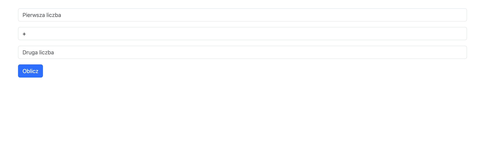

# Zadanie - JS 03

1. Odpal plik `index.html`

2. Dodaj kod w JS, który stworzy taki UI jak na screenshocie ponizej.
    - Kod JS dodaj w osobnym pliku
    - Zadbaj o odpowiednie typy inputów
    - Zadbaj o odpowiednie opcje selecta
    - Zadbaj o odpowiednie placeholdery
    - Inputom i selectowi przypisz klasę `form-control`
    - Inputom i selectowi przypisz margines dolny o wartosci `1rem`
    - Przycisk powinien mieć klasę `btn` i `btn-primary`

